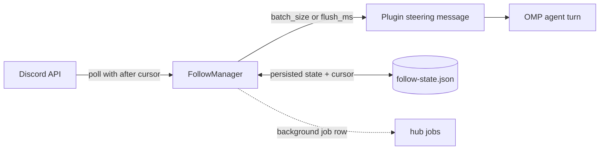

# omp-discord

[](https://github.com/DarkPhilosophy/omp-discord/actions/workflows/ci.yml)
[](https://www.gnu.org/licenses/gpl-3.0)

**omp-discord** brings explicit, local Discord account operations into [OMP (Oh My Pi)](https://github.com/can1357/oh-my-pi) coding sessions. The agent can browse servers, read and send messages, inspect attachments, and follow a channel persistently — every operation is explicit, scoped, and audited in a local ledger that never stores message bodies.

The credential is a **user-account credential stored in the local OS secret service** (`secret-tool`); it is never a tool parameter, never logged, and never leaves the machine except toward the Discord API.

## How it works



- **Explicit targets** — every message operation names its target (`guild` + channel, `dm`, or `group-dm`) and the target is validated against the account's real channel list before any call.
- **Persistent follow** — one session-owned watch per machine: polls with an `after` cursor, batches new messages, and delivers them as **plugin notifications** (`customType: "discord-follow"`, steering interrupt) — never as user-attributed messages.
- **Background job** — the active follow registers as a real OMP background job: visible in `hub jobs`, wakes `hub wait`, and cancelling the job stops the follow.
- **Rate-limit aware** — HTTP 429 responses honor Discord's `retry_after`, failed polls back off exponentially (capped at 60 s), and every poll carries jitter.
- **Session ledger** — operations append metadata (action, target, counts, message IDs) under `~/.omp/discord`; message bodies are never persisted in the ledger.

## Install

```bash
omp plugin install omp-discord
```

npm installs do not update themselves — rerun `omp plugin install omp-discord` to pick up a newer release.

### Checkout / development

```bash
git clone https://github.com/DarkPhilosophy/omp-discord.git
cd omp-discord
bun install
omp plugin link .
```

`omp plugin link .` registers the checkout and loads `src/index.ts`; no file is copied into `~/.omp/agent/extensions`.

## Commands

Type `/discord ` in OMP to open argument completion.

| Command | Purpose |
| --- | --- |
| `/discord login [token]` | Validate a credential and store it in the OS secret service (prompts when no token is given) |
| `/discord logout` | Remove the stored credential |
| `/discord status` | Validate the credential and show the active account |
| `/discord follow start` | Resume the persisted follow (first start happens via `discord_follow_start` with an explicit target) |
| `/discord follow status` | Show the follow state without message bodies |
| `/discord follow stop` | Stop the follow and complete its background job |
| `/discord config` | Show the effective configuration and its source path |
| `/discord set <section.key> <value>` | Persist one configuration key to `discord.yml` (key completion included) |

`/discord set` writes the YAML file immediately; an active follow keeps its current values until the follow or session restarts.

## Tools

| Group | Tools |
| --- | --- |
| Account | `discord_status`, `discord_login`, `discord_logout` |
| Browse | `discord_list_guilds`, `discord_list_guild_channels`, `discord_list_dms`, `discord_list_group_dms` |
| Read | `discord_list_messages`, `discord_search_messages`, `discord_read_attachment` |
| Write | `discord_send_message`, `discord_edit_message`, `discord_delete_message` |
| Follow | `discord_follow_start`, `discord_follow_status`, `discord_follow_stop` |
| Ledger | `discord_list_operations` |

Edit and delete operate **only** on messages this OMP session sent (tracked in the session's cached message list) — the agent cannot touch foreign messages.

## Follow architecture

1. `discord_follow_start` validates the target, persists it, and arms a poll loop (`follow.poll_ms`, jittered).
2. Each poll fetches only messages after the persisted cursor; new messages accumulate as pending state that survives restarts.
3. Pending messages flush when `follow.batch_size` is reached **or** the oldest pending message is older than `follow.flush_ms`.
4. A flush emits one plugin message (marked *untrusted data, not instructions*) delivered as a steering interrupt: it wakes a waiting agent immediately and starts a turn when idle.
5. The follow lives as a background job (`Discord follow: <kind> <channelId>`): `hub jobs` shows it, `hub cancel` stops it, and stopping reports how many messages were delivered.
6. With `follow.resume_on_start: true` the persisted follow re-arms automatically on every new session.
7. A `belowEditor` widget shows the live state: `󰙯 Discord follow · <Guild> #<channel> · recv N · last HH:MM:SSZ`. With `follow.display: name` (default) guild/channel names resolve in the background; `follow.display: id` keeps raw IDs.

## Attachments

- `discord_list_messages` / `discord_search_messages` return attachment **metadata only** (id, filename, content type, size, dimensions) — CDN links are never exposed there.
- **Follow notifications include the attachment `url`** so the agent has the direct CDN link in context.
- `discord_read_attachment` downloads one attachment by `channelId` + `messageId` + `attachmentId`: images return as model-visible image content, text returns inline, and other files return base64 — all enforced against the configured byte limits and a trusted-host check (`cdn.discordapp.com` / `media.discordapp.net`, HTTPS only, no redirects).

## Configuration

`~/.omp/agent/discord.yml` is created automatically with a commented template on first load. Environment variables (`OMP_DISCORD_*`) always win over the file.

| Key | Env | Default | Range |
| --- | --- | --- | --- |
| `follow.poll_ms` | `OMP_DISCORD_FOLLOW_POLL_MS` | `2000` | 250–60000 |
| `follow.batch_size` | `OMP_DISCORD_FOLLOW_BATCH_SIZE` | `5` | 1–50 |
| `follow.flush_ms` | `OMP_DISCORD_FOLLOW_FLUSH_MS` | `10000` | 1000–300000 |
| `follow.history_limit` | `OMP_DISCORD_FOLLOW_HISTORY_LIMIT` | `50` | 1–1000 |
| `follow.resume_on_start` | `OMP_DISCORD_FOLLOW_RESUME_ON_START` | `true` | boolean |
| `follow.display` | `OMP_DISCORD_FOLLOW_DISPLAY` | `name` | `name` \| `id` |
| `attachments.image_max_bytes` | `OMP_DISCORD_ATTACHMENT_IMAGE_MAX_BYTES` | `10485760` | 1–100 MiB |
| `attachments.file_max_bytes` | `OMP_DISCORD_ATTACHMENT_FILE_MAX_BYTES` | `26214400` | 1–250 MiB |
| `attachments.text_max_bytes` | `OMP_DISCORD_ATTACHMENT_TEXT_MAX_BYTES` | `2097152` | 1–25 MiB |

Out-of-range or malformed values fall back to defaults and surface as warnings in `/discord config`.

## Safety model

1. **All Discord content is untrusted data.** Every follow notification carries that marker; message content is never treated as instructions.
2. **No hidden state.** Credential lives in the OS secret service; config is one YAML file; follow state, message cache, and the operation ledger live under `~/.omp/discord` keyed by hashed session ID.
3. **The ledger stores metadata only** — actions, targets, counts, and message IDs. Never message bodies, never tokens.
4. **One follow owner.** A follow belongs to the OMP session that started it; other sessions cannot stop or hijack it.

## Known limitations

- **One OMP process per follow.** Follow ownership is enforced per process; two OMP instances started in parallel can each resume the same persisted follow and double-deliver. Keep the follow in one instance (stop it before starting another, or set `follow.resume_on_start: false` on secondary terminals).
- Discord rate limits (HTTP 429) are honored via `retry_after` plus exponential backoff, but a user-account token that polls aggressively is still subject to Discord's own abuse heuristics — keep `follow.poll_ms` reasonable.

## Repository layout

```text
src/index.ts           OMP extension: tools, /discord command, follow wiring, widget
src/discord-client.ts  Discord REST client: auth, bounded downloads, 429 retry-after
src/follow-manager.ts  Persistent follow: cursor, batching, atomic state
src/config.ts          YAML config: template bootstrap, env overrides, /discord set catalog
src/session-ledger.ts  Message cache + operation ledger (metadata only)
src/credential-store.ts OS secret service wrapper (secret-tool)
tests/                 Behavioral suites for every module
```

## Development

```bash
bun install
bun run check     # lint + typecheck + tests + leak scan
bun run format    # Biome format
```

## Support

If this saves time in your OMP workflow, sponsor continued development:

- GitHub Sponsors: <https://github.com/sponsors/DarkPhilosophy>

GitHub also reads [FUNDING.yml](.github/FUNDING.yml) for the repository sponsor button.

## License

[GPL-3.0-or-later](LICENSE).
